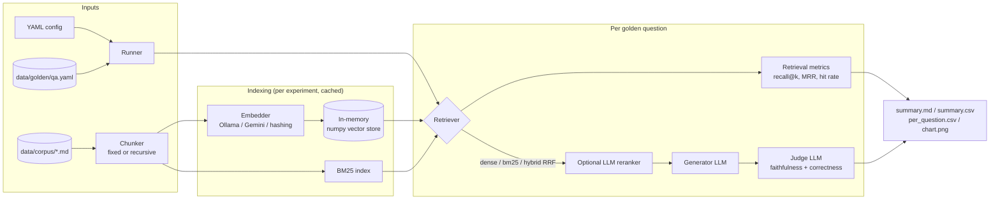

# rag-eval-lab

[](https://github.com/ajmalmansuri02/rag-eval-lab/actions/workflows/ci.yml)

**A learning lab, not a product.** I built this while learning AI engineering, to answer a
practical question with numbers instead of opinions: *which RAG settings actually matter?*

It is a small experiment harness that runs the same golden question set through different
retrieval-augmented generation (RAG) configurations and reports retrieval metrics, LLM-judged
answer quality, and latency side by side. Everything runs **locally and free**: Ollama by
default, the Gemini free tier as an optional provider, and an offline mode that needs no models
at all.

The corpus is a set of 17 short docs about **Driftbox**, a fictional file-sync product I made up
for this lab, plus 33 golden questions with reference answers and the documents that answer them.

## What it teaches

| Topic | Where to look |
|---|---|
| Fixed-size vs. heading-aware recursive chunking, chunk size and overlap | `chunking.py`, `configs/chunking-sweep.yaml`, `rag-eval chunks` |
| Dense retrieval with embeddings and a brute-force numpy vector store | `embeddings.py`, `vectorstore.py` |
| Lexical retrieval with BM25 (written from scratch, about 60 lines) | `bm25.py` |
| Hybrid retrieval with reciprocal rank fusion (RRF) | `retrieval.py` |
| Second-stage reranking (an LLM used as a pointwise relevance rater) | `retrieval.py` (`LLMReranker`) |
| Retrieval metrics: recall@k, MRR, hit rate | `metrics.py` |
| LLM-as-judge with explicit rubrics, scoring faithfulness and correctness separately | `judge.py` |
| Embedding task prefixes (`search_query:` / `search_document:`) and their effect | `configs/embedding-sweep.yaml` |
| Why you need a golden set, including unanswerable questions | `data/golden/qa.yaml` |
| Testing LLM code without an LLM (fakes, `httpx.MockTransport`) | `tests/` |

## Architecture



Package layout:

```
src/rag_eval_lab/
  corpus.py       load docs + golden set
  chunking.py     fixed-size and heading-aware recursive chunkers
  embeddings.py   Ollama, Gemini and hashing embedders, document-embedding cache
  vectorstore.py  in-memory cosine-similarity store (numpy), save/load to .npz
  bm25.py         Okapi BM25
  retrieval.py    dense, BM25, hybrid (RRF), LLM reranker
  llm.py          Ollama, Gemini and an offline heuristic stand-in
  generation.py   grounded answer prompt
  judge.py        rubrics + robust score parsing
  metrics.py      recall@k, MRR, hit rate, percentiles
  config.py       YAML -> dataclasses, defaults merged into each experiment
  runner.py       runs experiments, times everything, aggregates
  report.py       markdown table, CSVs, chart
  cli.py          `rag-eval run | chunks | check`
```

Design choices worth knowing:

- **No framework.** No LangChain or LlamaIndex: every step is a short, readable function, which
  is the point of a learning repo.
- **Plain HTTP to model providers** with `httpx`, so the moving parts are visible.
- **Brute-force vector search.** For a few hundred chunks, one matrix-vector product is exact and
  takes microseconds. An ANN index would add complexity without changing results.
- **Chunk sizes are in words**, not model tokens (about 1.3 tokens per English word). This keeps
  the lab tokenizer-free.
- **Document embeddings are cached** on disk (`.cache/embeddings/`) by content hash, so a sweep
  over retrieval settings only embeds each chunk once. Query embeddings are never cached, which
  keeps retrieval latency honest.

## Quickstart

Requirements: Python 3.11+, and [Ollama](https://ollama.com) for real runs.

```bash
git clone https://github.com/ajmalmansuri02/rag-eval-lab.git
cd rag-eval-lab
python3 -m venv .venv && source .venv/bin/activate
make install            # pip install -e ".[dev]"
make test               # unit tests, no models needed
make offline            # end-to-end smoke run, no models needed
```

Real run with local models:

```bash
ollama pull nomic-embed-text
ollama pull qwen2.5:3b       # generator
ollama pull qwen2.5:7b       # judge (a bigger judge than generator)
make check                   # verifies Ollama is up and the models are pulled
make quick-retrieval         # retrieval metrics only, fast
make quick                   # adds generation + LLM judge (slow on CPU)
```

Other useful commands:

```bash
rag-eval run configs/chunking-sweep.yaml --retrieval-only
rag-eval run configs/quick.yaml --limit 10 --experiment hybrid-rrf   # iterate on a subset
rag-eval run configs/quick.yaml --no-judge                           # answers without judging
rag-eval chunks pricing-plans --strategy fixed --size 60 --overlap 10  # see how a doc is chunked
```

### Gemini (optional, free tier)

Copy `.env.example` to `.env`, set `GEMINI_API_KEY`, `GEMINI_MODEL` and `GEMINI_EMBED_MODEL`
(check Google AI Studio for which models are on the free tier right now), then:

```bash
rag-eval run configs/gemini.yaml --limit 10
# or point any config at Gemini:
rag-eval run configs/quick.yaml --provider gemini --limit 10
```

Free-tier quotas are small. The client throttles itself (`GEMINI_REQUESTS_PER_MINUTE`, default
10) and retries on HTTP 429, so start with `--limit`.

### Offline mode

`--provider offline` (or `RAG_LAB_PROVIDER=offline`) swaps in a hashing embedder (a hashed
bag-of-words: lexical overlap, no meaning) and a heuristic stand-in for the LLM that answers by
picking the context sentence with the most word overlap. It exists so CI and newcomers can run
the full pipeline. **Its answer-quality scores mean nothing**, and the report says so.

## Writing a config

```yaml
name: my-experiment
top_k: 5
generate: true
judge: true
generator: {provider: ollama, model: qwen2.5:3b}
judge_llm: {provider: ollama, model: qwen2.5:7b}

defaults:                       # merged into every experiment
  chunking: {strategy: recursive, chunk_size: 200, overlap: 20, include_headings: true}
  embedding: {provider: ollama, model: nomic-embed-text,
              query_prefix: "search_query: ", document_prefix: "search_document: "}
  retrieval: {method: dense, rrf_k: 60, candidates: 20, bm25_k1: 1.5, bm25_b: 0.75}
  rerank: {enabled: false, candidates: 10}

experiments:                    # each one only lists what differs
  - name: dense
  - name: hybrid
    retrieval: {method: hybrid}
  - name: hybrid-small-chunks
    chunking: {chunk_size: 80}
    retrieval: {method: hybrid}
```

Providers: `ollama` (default), `gemini`, and for offline use `hashing` (embeddings) or `offline`
(LLM). Unknown keys are rejected, so typos fail loudly.

## How to read the results

Each run writes `results/<name>-<timestamp>/`:

| File | Contents |
|---|---|
| `summary.md` | the comparison table, best value per column in bold |
| `summary.csv` | the same numbers, for a spreadsheet or notebook |
| `per_question.csv` | every question x experiment: retrieved docs, answer, judge scores and reasons |
| `chart.png` | retrieval metrics, answer quality and latency per experiment |
| `run.json` | the fully resolved config, for reproducibility |

The columns:

- **Recall@k**: of the documents that answer the question, what fraction appeared in the top-k
  retrieved chunks? Low recall means the generator never sees the answer.
- **MRR** (mean reciprocal rank): 1 / rank of the first relevant document, averaged. High recall
  with low MRR means the answer is in there but buried; reranking targets exactly this.
- **Hit@k**: did at least one relevant document show up? For single-document questions this
  equals recall.
- **Faithful**: judge score for "is every claim supported by the retrieved context?" This is a
  hallucination check. It ignores whether the answer is correct.
- **Correct**: judge score for "does the answer match the reference answer?" This is the
  end-to-end number users feel.
- **Retr ms / Retr p95 / Gen ms**: mean and 95th-percentile retrieval latency, and mean
  generation latency, per question. Reranking shows up as retrieval latency because it is part of
  retrieval.

Details that affect interpretation:

- Retrieval metrics are **document-level**: chunk rankings are collapsed to unique document IDs
  first. They are averaged over **answerable questions only**. The two unanswerable questions
  still count for answer quality: the correctness rubric rewards declining to answer.
- Some questions list two documents where *either* one answers (tagged `multi-source`). Recall
  counts both, so recall there understates usefulness; hit rate is the fairer metric for them.
- Judge scores use a 1-5 rubric (see `judge.py`) mapped to 0-1 as (score - 1) / 4. Judges are
  noisy and can be biased toward fluent answers. Read the `*_reason` columns in
  `per_question.csv` before trusting a small difference.
- With 31 answerable questions, one question is worth about 0.03 of recall. **Differences under
  roughly 0.05 are noise** unless they are consistent across sweeps.
- Patterns worth looking for: high faithfulness with low correctness means retrieval missed and
  the model correctly refused or answered from the wrong chunk. Low faithfulness with high
  correctness means the model answered from its own knowledge or guessed, which is a red flag
  even when it happens to be right.

### Example output (offline mode)

This is what the table looks like from `make offline`. The retrieval columns are real (hashing
embeddings vs. BM25 on this corpus); the answer-quality columns come from the heuristic stand-in
and are **not meaningful**.

| Experiment | Chunking | Embedding | Retrieval | Rerank | Chunks | Recall@k | MRR | Hit@k |
|---|---|---|---|---|---:|---:|---:|---:|
| fixed-120-dense | fixed-120/20 | hashing | dense | none | 29 | 0.806 | 0.707 | 0.839 |
| recursive-120-dense | recursive-120/20 | hashing | dense | none | 63 | 0.871 | 0.849 | 0.903 |
| recursive-120-bm25 | recursive-120/20 | - | bm25 | none | 63 | **0.968** | 0.911 | **0.968** |
| recursive-120-hybrid | recursive-120/20 | hashing | hybrid | none | 63 | 0.919 | 0.898 | 0.935 |
| recursive-120-hybrid-rerank | recursive-120/20 | hashing | hybrid | llm@10 | 63 | 0.919 | **0.919** | 0.935 |

Real-model results are not checked in, because they depend on the hardware and model versions
you run. Fill in your own below.

## What I learned

> Placeholders, filled in as I run the experiments on my own machine.

- **Chunking:** _TODO: which strategy/size won on this corpus, and why I think it did._
- **Embedding models and prefixes:** _TODO: did task prefixes matter for nomic-embed-text? How
  far ahead of the hashing baseline were real embeddings?_
- **BM25 vs. dense vs. hybrid:** _TODO: which questions did each one miss? (Look at exact-string
  questions like error codes and token prefixes.)_
- **Reranking:** _TODO: did it improve MRR enough to justify the extra latency?_
- **LLM-as-judge:** _TODO: how often did I disagree with the judge when spot-checking reasons?_
- **Latency vs. quality trade-off:** _TODO._
- **Surprises:** _TODO._

## Ideas for next steps

- Add a cross-encoder reranker (for example a small BGE reranker via `sentence-transformers`) and
  compare it with the LLM reranker on quality and latency.
- Query rewriting: HyDE (embed a hypothetical answer) or multi-query expansion.
- Semantic chunking: split where embedding similarity between adjacent sentences drops.
- Swap the numpy store for an embedded vector DB (LanceDB, Chroma, sqlite-vec) and check that
  results do not change.
- Bootstrap confidence intervals per metric, so the report can say which differences are real.
- Measure judge agreement: re-judge a sample with a second model or by hand and compute
  agreement (Cohen's kappa).
- Grow the golden set with harder cases: multi-hop questions, near-duplicate distractor docs,
  questions phrased with synonyms that BM25 cannot match.
- Context-window experiments: vary `top_k` and chunk size together at a fixed token budget.
- Track runs over time (a tiny SQLite results store or MLflow) instead of timestamped folders.

## Development

```bash
make lint      # ruff check + ruff format --check
make format    # auto-fix
make test      # pytest, no network or models needed
```

Tests use a deterministic hashing embedder, a scripted fake LLM and `httpx.MockTransport`, so
they run in a couple of seconds with no Ollama. CI (GitHub Actions) runs lint, tests on Python
3.11 to 3.13, and an offline smoke run.

## License

MIT, see [LICENSE](LICENSE). The Driftbox corpus is fictional and written for this repository.
